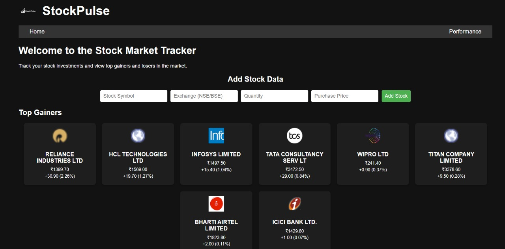
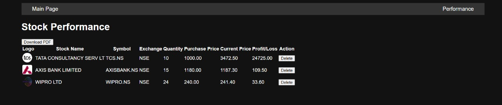

# StockPulse - Stock Performance Tracker

StockPulse is a web application designed to help you track your stock investments, monitor market trends, and generate professional reports for your portfolio. With a clean and modern interface, StockPulse makes managing your investments simple and efficient.

---

## 🚀 Features

- **Portfolio Management**: Add, update, and delete stocks in your portfolio with ease.
- **Market Insights**: View top gainers and losers in the Indian stock market (NSE) with stock logos and real-time price changes.
- **Performance Overview**: Analyze your portfolio in a detailed table that includes stock logos, names, symbols, exchange, quantity, buy price, current price, and profit/loss.
- **PDF Reporting**: Export your portfolio as a professional PDF report, complete with stock logos and names, matching the table view.
- **Modern UI**: Enjoy a clean, dark-themed interface for seamless tracking and analysis.

---

## 📸 Screenshots

<<<<<<< main
### 🟢 Main Page – Top Gainers
Displays top gainers in the Indian stock market with real-time updates and logos.



---

### 📊 Portfolio Performance Tab
View detailed performance of your portfolio including profit/loss for each stock.


=======
### Main Page (Top Gainers)


### Performance Tab


### Downloaded PDF Report

>>>>>>> main

---

### 📄 PDF Portfolio Report
Download a professional-looking PDF report of your stock portfolio.


## 🎥 Demo Video

<video width="700" controls>
  <source src="screenshots/Recording 2025-04-30 013139.mp4" type="video/mp4">
  Your browser does not support the video tag.
</video>


---

## 💡 Benefits

- **Visual Portfolio**: Instantly see your stock performance with logos and names.
- **Easy Reporting**: Download a PDF report for sharing or record-keeping.
- **Market Insights**: Track top gainers and losers in real time.
- **Simple Management**: Add, update, and delete stocks with ease.

---

## 🛠️ Tech Stack

- **Backend**: Python, Flask, yfinance, nsetools, FPDF
- **Frontend**: HTML, CSS, JavaScript
- **PDF Generation**: FPDF with dynamic logo embedding

---

## ⚡ Getting Started

1. **Clone the repository:**
    ```bash
    git clone https://github.com/YOUR-USERNAME/stock-performance-tracker.git
    cd stock-performance-tracker
    ```

2. **Install dependencies:**
    ```bash
    pip install -r requirements.txt
    ```

3. **Run the app:**
    ```bash
    python app.py
    ```
    Visit [http://localhost:5000](http://localhost:5000) in your browser.

---

## 📂 Project Structure

```
.
├── app.py
├── user_stocks.csv
├── static/
│   ├── css/
│   │   └── styles.css
│   └── js/
│       ├── script.js
│       └── performance.js
├── templates/
│   ├── index.html
│   └── performance.html
├── screenshots/
│   ├── main_page.png
│   ├── performance_tab.png
│   └── pdf_report.png
└── README.md
```

---

## 🙏 Credits

- [yfinance](https://github.com/ranaroussi/yfinance)
- [nsetools](https://github.com/vsjha18/nsetools)
- [FPDF](https://pyfpdf.github.io/)

---

## 📧 Contact

For questions or suggestions, open an issue or contact [dippadwal89@gmail.com].

---

*Happy Investing!*
